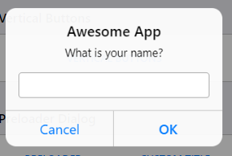

# Framework9

Этот фреимворк можно считать переписанной версией Framework7 на React.

## Цель

Этот фреймворк ставит невероятную цель совместить самые лучшие практики из таких фреймворков как:

### [Framework7](https://framework7.io/)

> Далее буду называть его f7.

Framework7, пожалуй, содержит больше всего хорошо проработанных компонентов и потрясающей логикой глобальных параметров,  (точнее параметры, но они часто дублируют) для любого компонента во всем приложении. Это самый удобный фреймворк для написания мобильных приложений. Однако он написан не в духе *React way*. React версия - это всего лишь обертка над core версией. А это значит, что использовать его комфортно на React не получится, там сплошные костыли.

#### Плюсы f7

- ##### Глобальные пропсы

Как и в *Ionic* у нас должен быть корневой компонент для всего приложения. В f7 случае он принимает проп params - глобальные параметры для всего приложения:

```tsx
<App params={{
    // 1
    name: "Awesome App",
    version: "3.4.1",
    // ...

    // 2
    dialog: {
        // дефолтные настройки dialog
        buttonCancel: "Отмена", // по умолчанию - Cancel
    },
    // 3
    myCard: {
        style: true
    }
}}>
    {/* все компоненты приложения, расположенные где-нибудь глубоко в дереве */}
</App>
```

1. Тут идут общие параметры (это не параметры конкретных компонентов), к примеру `name` смогут использовать диалоги как тайтл по умолчанию:

Еще раз, `name` не задает заголовок для диалогов по умолчанию, это независимый параметр. Он может использоваться любым компонентом. С `version` ситуация та же, но все-таки f7 компоненты его сами по себе не используют (но дальше еще пойдет речь про него). `language` может в теории использоваться компонентами для перевода. Опять же, это очень удобно, что можно один раз задать такого рода настройки, что бы не прописывать их каждый раз в пропсы компонентов. удобно же иметь все общие настройки в **одном месте**, не правда ли?.

2. Расширяем параметры компонентов. К примеру здесь `dialog` перезаписывает значение по умолчанию для диалогов, подтверждающих действие пользователя. Теперь у них будет кнопка для отмены с текстом `Отмена`, а не `Cancel`. Но опять же, это только в том случае если мы явно не передадим соответствующий проп компоненту.
3. Однако, мы можем расширять настройки не только "встроенных" компонентов в f7, но и компонентов из других источников (Плагины). *TODO*

#### Минусы Framework7

- Глобальный инжект f7 во все классовые компоненты вместо использования хуков (не React way).
- Для использования React компонента, его надо отдельно подключать из core библиотеки.

<!-- ### [Ionic](https://ionicframework.com/)

Ionic, как и Framework7 тоже написан без использования React. А React версия - это всего лишь обертка.

Он более лаконичен, чем f7, хотя в некоторых местах уж слишком ограничены возможности.

#### Плюсы Ionic

 - Традиционная система роутинга (react-router), плюс Ionic умеет сам расставлять кнопки Назад на страницах, когда это необходимо.
 - Более шустрый, чем f7 (скорее всего из-за [WebComponents](https://developer.mozilla.org/ru/docs/Web/Web_Components) под капотом).

#### Минусы Ionic

- «находить красоту в простоте» - это явно не про Ionic. Просто ОГРОМНЕЙШИЕ бойлерплейты (повторяющиеся участки кода) для многих компонентов.

- Сильно ограничен функционал -->

### [Material-UI](https://material-ui.com/)

Это самый **замороченный** фреймворк, то какие техники он использует внутри себя - это потрясающе.
Также это **самый типизированный** фреймворк, ребята явно дружат с TypeScript.

А бы использовал его для создания мобильных приложений, если бы не отсутствие IOS темы (ну это и так понятно по названию - только MD). Зато он, как по мне, лучший, для создания десктопных приложений (к примеру на Electron).

#### Плюсы Material-UI

- ##### Полная изоляция всех компонентов

Material-UI использует непростой подход для стилизации своих компонентов JSS ([подробней в доках](https://material-ui.com/styles/basics/)).
К примеру для правильной работы всех предыдущих фреймворков (VKUI, Framework7), необходимо отдельно подключать CSS стили.
Однако в Material-UI достаточно любой отдельный компонент, и он уже будет содержать в себе стили все необходимые ему стили, ну и понятное дело никаких конфликтов классовых имен.
